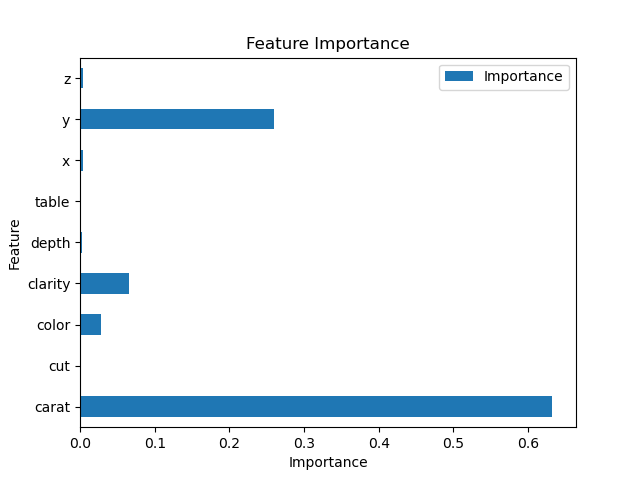
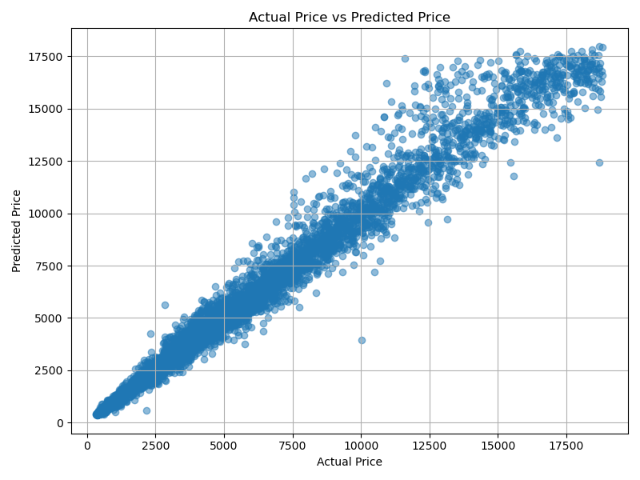

# 💎 Diamond Price Prediction using Random Forest Regression

## 📌 Project Overview

This project predicts diamond prices using **Random Forest Regression**. The model was trained on a dataset containing various physical characteristics of diamonds such as carat, cut, color, clarity, depth, table, and dimensions to accurately estimate the diamond price.

---

## 📂 Dataset

The dataset contains information about diamonds, including:

- Carat
- Cut
- Color
- Clarity
- Depth
- Table
- X Dimension
- Y Dimension
- Z Dimension

**Target Variable:**

- Price

---

## 🛠️ Technologies Used

- Python
- Numpy
- Pandas
- Matplotlib
- Scikit-learn
- Jupyter Notebook

---

## 🔄 Project Workflow

- Data Loading
- Data Exploration
- Data Preprocessing
- Feature & Target Selection
- Train-Test Split
- Random Forest Regression Model
- Model Training
- Prediction
- Model Evaluation
- Feature Importance Analysis
- Actual vs Predicted Comparison
- Feature Importance Visualization

---

## ⚙️ Model Hyperparameters

The Random Forest model was built using the following hyperparameters:

- n_estimators = 200
- max_depth = 15
- min_samples_split = 5
- min_samples_leaf = 2
- random_state = 42

---

## 📊 Model Performance

| Metric | Value |
|---------|------:|
| R² Score | **YOUR_R2_SCORE** |
| Mean Absolute Error (MAE) | **YOUR_MAE** |
| Mean Squared Error (MSE) | **YOUR_MSE** |
| Root Mean Squared Error (RMSE) | **YOUR_RMSE** |

---

## 📈 Feature Importance

---

## 📉 Actual vs Predicted Prices

---

## 📌 Conclusion

The Random Forest Regression model successfully learned the relationship between the physical characteristics of diamonds and their market prices. By combining predictions from multiple decision trees, the model produced accurate and stable price predictions while reducing the risk of overfitting.

The model achieved an **R² Score of YOUR_R2_SCORE**, with an **MAE of YOUR_MAE**, **MSE of YOUR_MSE**, and an **Out-of-Bag Score of YOUR_OOB_SCORE**, demonstrating strong predictive performance on unseen data.

---

## 🚀 Future Improvements

- Perform Hyperparameter Tuning using GridSearchCV or RandomizedSearchCV.
- Compare performance with XGBoost Regression.
- Evaluate the model using Cross-Validation.
- Deploy the trained model as a web application using Flask or Streamlit.
